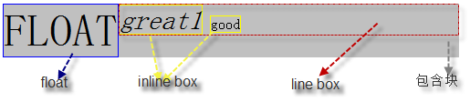

### 主要内容
- 浮动float
- 定位position
- 行高line-height
- 水平居中与垂直居中
- 滑动门
- html调色原理
- 盒子模型
- 双飞翼布局及圣杯布局

### 定位position
- #### relative
    即使偏移，位置还在。实质就是靠近最近的元素进行偏移。```解释：可以理解为让自身元素的原点（0，0）进行偏移（左上），相对于自己移动。    ```
- #### absolute
    偏移了，位置就没了，靠最近的relative/absolute进行偏移。``` 解释：absolute 进行偏移的时候默认先去寻找外面position属性设为 absolute 或者 relative 的元素，如果有相对 它进行偏移，如果没有相对于浏览器左上角（0，0）进行偏移。```
- #### fixed
    相对于浏览器的窗口的位置，没有依赖感
- #### static(默认)

### 定位 top
- 当position为static时，计算值是auto
- 为relative时
   -  如果top和bottom都是auto，则它们的计算值是0
   -  如果top和bottom其中一个为auto，则auto相当于另一个的负值，即top = -bottom；
   -  如果top和bottom的值都不为auto，则忽略bottom

### margin折叠常规
- margin折叠只发生在块级元素上；
- 浮动元素的margin不与任何margin发生折叠;
- 绝对定位元素的margin不与任何margin发生折叠；
- 根元素的margin不与其它任何margin发生折叠;

### 样式的权重
- important > 内联 > ID > 类 > 标签 | 伪类 | 属性选择 > 伪对象 > 通配符 > 继承
-   CSS样式权重的两个重要因素
    -   样式的优先级跟样式定义的顺序有关
    -   权值的大小跟选择器的类型和数量有关
```
 注意：一般来说，在同一个CSS文件中，如果有两个同名的样式，则后定义的会覆盖先定义的
```
- 一个selector的权重表示方式：0.0.0.0，即·``` 内嵌样式.ID样式.(类,伪类,以及属性个数).(伪元素和标签元素个数)```
```
注：通配符和继承得到的CSS属性对权重没有影响
权重的比较并不一定可靠   例 1.0.0.0>0.11.1.1
```

### display:inline-block引发的间隙
解决方式
- 通过设置父容器的字体大小为0，子容器的字体大小为>0的值

    .outer {
        font-size: 0;
        -webkit-text-size-adjust:none;/**取消Chrome浏览器最小字体限制*/
    }
    .outer .inner {
        font-size: 12px;
    }
    说明：现在chrome浏览器已经取消最小字体限制
- 设置浮动
    float: left;

### 水平居中
- 行内元素解决方案

```
行内元素的父级为块级元素或包含display:block样式只需设置text-align:center;
```

- 块状元素解决方案
```
margin:10px auto;
```

- 多个块状元素解决方案

```
父级设置text-align:center;
块级元素设置:display:inline-block;
```

- 多个块状元素解决方案 (使用flexbox布局实现)
```
父级设置 display:flex;justify-content:center;
```

### 垂直居中
- 单行的行内元素解决方案
```
.parent {
    height: 200px;
}
/* 以下代码中，将a元素的height和line-height设置的和父元素一样高度即可实现垂直居中 */
a {
    height: 200px;
    line-height:200px; 
 }
```    

- 多行的行内元素解决方案
    > 定义需要居中的父容器元素display:table-cell;vertical-align:middle;
```
.parent {
    width: 300px;
    height: 300px;
    /* 以下属性垂直居中 */
    display: table-cell;
    vertical-align:middle;
}
```
    
- 已知高度的块状元素解决方案
```
.item{
    height:100px;
    top:50%;
    margin-top:-50px;
    position:absolute;
    padding:0;
}
```

- 未知高度的块状元素解决方案
```
.item{
    top: 50%;
    position: absolute;
    transform: translateY(-50%);  /* 使用css3的transform来实现 */
}
```

### 水平垂直居中
- 已知高度和宽度的元素解决方案1

        .item{
            position: absolute;
            margin:auto;
            left:0;
            top:0;
            right:0;
            bottom:0;
        }

- 已知高度和宽度的元素解决方案2

        .item{
            position: absolute;
            top: 50%;
            left: 50%;
            height: 400px;
            width: 300px;
            margin-top: -200px;
            margin-left:-150px;
        }
- 未知高度和宽度元素解决方案

        .item{
            position: absolute;
            top: 50%;
            left: 50%;
            transform: translate(-50%, -50%);  /* 使用css3的transform来实现 */
        }
### 圣杯布局
``` html
    <!DOCTYPE html>
    <html>
    <head>
        <meta charset="utf-8">
        <meta http-equiv="X-UA-Compatible" content="IE=edge,chrome=1">
        <title>圣杯布局</title>
        <style>
        html,
        body {
            margin: 0;
            padding: 0;
        }

        .container {
            border: 1px solid;
            padding: 0 100px;
            width: 500px;
        }

        .container:after {
            content: '';
            display: block;
            clear: both;
            height: 0;
        }

        .main {
            width: 100%;
            height: 300px;
            background-color: red;
            float: left;
        }

        .aside {
            width: 100px;
            height: 100px;
            background: blue;
            float: left;
            position: relative;
            left: -100px;
            margin-left: -100%;
        }

        .extra {
            width: 100px;
            height: 100px;
            float: left;
            background: yellow;
            position: relative;
            left: 100px;
            margin-left: -100px;
        }
        </style>
    </head>

    <body>
        <div class="container">
            <div class="main"></div>
            <div class="aside"></div>
            <div class="extra"></div>
        </div>
    </body>

    </html>
```

### 双飞翼布局
``` html
    <!DOCTYPE html>
    <html>
    <head>
        <meta charset="utf-8">
        <meta http-equiv="X-UA-Compatible" content="IE=edge,chrome=1">
        <title>双飞翼布局</title>
        <style>
        html,
        body {
            margin: 0;
            padding: 0;
        }

        .container {
            border: 1px solid;
            width: 500px;
        }

        .container:after {
            content: '';
            display: block;
            clear: both;
            height: 0;
        }

        .main {
            width: 100%;
            height: 300px;
            float: left;
        }

        .main .wrap {
            background: pink;
            height: 300px;
            margin-left: 100px;
            margin-right: 100px;
        }

        .aside {
            width: 100px;
            height: 100px;
            background: blue;
            float: left;
            margin-left: -100%;
        }

        .extra {
            width: 100px;
            height: 100px;
            float: left;
            background: yellow;
            margin-left: -100px;
        }
        </style>
    </head>
    <body>
        <div class="container">
            <div class="main">
                <div class="wrap"></div>
            </div>
            <div class="aside"></div>
            <div class="extra"></div>
        </div>
    </body>
    </html>
```

两种布局的对比
1. 两种布局方式都是把主列放在文档流最前面，使主列优先加载；
2. 两者在实现上的相同点在于都让三列浮动，然后通过负外边距形成三列布局；
3. 两种布局方式的不同在于如何处理中间主列的位置：圣杯布局是利用父容器的左右内边距定位；双飞翼布局是把主列嵌套在div后利用主列的左右外边距定位。

### 企业DIV使用频率高的命名方法
- 网页内容类
    - 标题: title
    - 摘要: summary
    - 箭头： arrow
    - 商标： label
    - 网站标志： logo
    - 转角/圆角： corner
    - 横幅广告： banner
    - 子菜单： subMenu
    - 搜索： search
    - 搜索框： searchBox
    - 登录： login
    - 登录条：loginbar
    - 工具条： toolbar
    - 下拉： drop
    - 标签页： tab
    - 当前的： current
    - 列表： list
    - 滚动： scroll
    - 服务： service
    - 提示信息： msg
    - 热点：hot
    - 新闻： news
    - 小技巧： tips
    - 下载： download
    - 栏目标题： title
    - 热点： hot
    - 加入： joinus
    - 注册： regsiter
    - 指南： guide
    - 友情链接： friendlink
    - 状态： status
    - 版权： copyright
    - 按钮： btn
    - 合作伙伴： partner
    - 投票： vote
    - 左右中：left right center
- 页面结构
    - 容器: container
    - 页头：header
    - 内容：content/container
    - 页面主体：main
    - 页尾：footer
    - 导航：nav
    - 侧栏：sidebar
    - 栏目：column
    - 页面外围控制整体布局宽度：wrapper
    - 左右中：left right center
- 导航
    - 导航：nav
    - 主导航：mainbav
    - 子导航：subnav
    - 顶导航：topnav
    - 边导航：sidebar
    - 左导航：leftsidebar
    - 右导航：rightsidebar
    - 菜单：menu
    - 子菜单：submenu
    - 标题: title
    - 摘要: summary
- 功能
    - 标志：logo
    - 广告：banner
    - 登陆：login
    - 登录条：loginbar
    - 注册：regsiter
    - 搜索：search
    - 功能区：shop
    - 标题：title
    - 加入：joinus
    - 状态：status
    - 按钮：btn
    - 滚动：scroll
    - 标签页：tab
    - 文章列表：list
    - 提示信息：msg
    - 当前的: current
    - 小技巧：tips
    - 图标: icon
    - 注释：note
    - 指南：guild
    - 服务：service
    - 热点：hot
    - 新闻：news
    - 下载：download
    - 投票：vote
    - 合作伙伴：partner
    - 友情链接：link
    - 版权：copyright
    
### 推荐的 CSS 书写顺序
- 显示属性
    - display
    - list-style
    - position
    - float
    - clear
- 自身属性
    - width
    - height
    - margin
    - padding
    - border
    - background
- 文本属性
    - color
    - font
    - text-decoration
    - text-align
    - vertical-align
    - white-space
    - other text
    - content
### 属性的继承性

- **不可继承的：** display、margin、border、padding、background、height、min-height、max-height、width、min-width、max-width、overflow、position、left、right、top、bottom、z-index、float、clear、table-layout、vertical-align、page-break-after、page-bread-before和unicode-bidi。
- **所有元素可继承：** visibility和cursor。
- **内联元素可继承：** letter-spacing、word-spacing、white-space、line-height、color、font、font-family、font-size、font-style、font-variant、font-weight、text-decoration、text-transform、direction。
- **终端块状元素可继承：** text-indent和text-align。
- **列表元素可继承：** list-style、list-style-type、list-style-position、list-style-image。
- **表格元素可继承：** border-collapse。

### 常规流
1 块级格式化上下文（BFC）

1.1 定义
> BFC是一个独立的渲染区域，BFC里面的元素不论怎么翻江倒海，使劲折腾都不会影响到外面的元素。在BFC中，每一个元素左外边与包含块的左边相接触（对于从右到左的格式化，右外边接触右边）， 即使存在浮动也是如此。

1.2 触发方式
- 浮动（float值不为none）
- 绝对定位（position值不为relative和static）
- display值为table-cell，table-caption，inline-block，flex，inline-flex中任何一个
- overflow值不为visible

1.3 应用
- 阻止外边距折叠
- 包含浮动元素
- 防止文字环绕

2 行内格式化上下文（IFC）

2.1 内容区域（content area）
   它是一种围绕文字看不见的盒子，它的大小与font-size大小相关。可近似将鼠标选中文字的区域看做内容区域。

2.2 行内框（inline boxes）
行内框不会让内容成块显示，而是排成行。如果文字外含inline水平的标签（span，a，em等），则属于行内框，如果是光秃秃的文字，则属于匿名行内框。
2.3 行框（line boxes）
每一行就是一个行框，每个行框又是由一个一个行内框组成的。
2.4 包含盒子（containing box）
p标签所在的包含盒子，由一行一行的行框组成。注意与p元素的块不是一回事。

#### 常见问题
- 图片底部有间隙怎么处理？
    - 图片块状化（无基线对齐了）
    `img {display: block;}`
    - 图片底线对齐
    `img {vertical-align: bottom;}`
    - 行高足够小（导致基线上移）
    `.box {line-height: 0;}`
